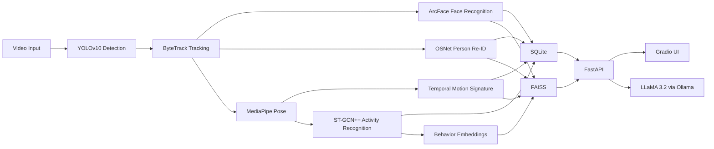

# VIAS — Visual Intelligence & Analysis System

VIAS is a local-first surveillance analytics platform that performs person detection, multi-object tracking, face recognition, person re-identification, pose estimation, activity recognition, Temporal Motion Signature generation, event logging, FAISS-based retrieval, and natural-language querying with a local Ollama-served LLaMA 3.2 model.

## Architecture



## Project Structure

```text
VIAS/
├── backend/
├── frontend/gradio_ui/
├── datasets/
├── models/
├── faiss_store/
├── sqlite_db/
├── configs/
├── tests/
├── docker/
├── requirements.txt
├── docker-compose.yml
└── README.md
```

## Components

- `YOLOv10Detector`: Loads local YOLOv10 weights when available and falls back to OpenCV HOG for offline demo continuity.
- `ByteTrackService`: Provides ByteTrack-inspired two-stage association with motion-aware matching and lost-track recovery.
- `MultiTierReIDService`: Implements ArcFace-first, OSNet-second, and TMS-third identity selection logic with real local model hooks and deterministic fallback.
- `TemporalMotionSignatureService`: Builds a 16-dimensional motion signature from 60-frame MediaPipe pose windows and supports DTW matching.
- `STGCNPlusPlusService`: Provides activity classification hooks for Walking, Standing, Sitting, Waving, and Hand Raising.
- `FAISSStore`: Stores face, body, TMS, and behavior embeddings locally.
- `NLQueryEngine`: Uses local Ollama LLaMA 3.2 for NL-to-SQL, with safe rule-based fallback logic.

## Database Schema

Tables created automatically in `sqlite_db/vias.db`:

- `persons`
- `tracks`
- `activities`
- `tms_vectors`
- `events`
- `queries`

## API

- `POST /upload-video`
- `POST /upload-reference-image`
- `POST /search-person`
- `POST /query`
- `POST /behavior-search`
- `GET /activities`
- `GET /analytics`
- `GET /datasets`
- `GET /events`
- `GET /models/status`
- `GET /tracks`
- `GET /health`

FastAPI docs are available at `http://127.0.0.1:8000/docs` after startup.

## Local Run

1. Create a Python 3.11 virtual environment.
2. Install dependencies:

```bash
pip install -r requirements.txt
```

3. Start the backend:

```bash
uvicorn backend.main:app --host 127.0.0.1 --port 8000 --reload
```

4. Start the Gradio UI:

```bash
python frontend/gradio_ui/app.py
```

5. Optional: start Ollama with local LLaMA 3.2:

```bash
ollama run llama3.2
```

## Docker

```bash
docker compose up --build
```

## Training Scripts

- `scripts/train_detection.py`
- `scripts/train_reid.py`
- `scripts/train_activity.py`
- `scripts/train_tms.py`
- `scripts/evaluation.py`
- `scripts/benchmark.py`
- `scripts/sample_data_pipeline.py`

Each training script includes local checkpoint output and TensorBoard logging hooks.

## Notes

- This project is production-structured and fully local.
- For best fidelity to the requested stack, place trained weights in the configured `models/` subdirectories.
- Apple Silicon is supported through automatic `mps` selection where the runtime stack allows it.
- Dataset folders can be placed under `datasets/` following `datasets/README.md`.
- The current build now includes stronger tracking and dataset/model status introspection, while ArcFace, OSNet, and ST-GCN++ still need true model-backed inference for full research-grade performance.
